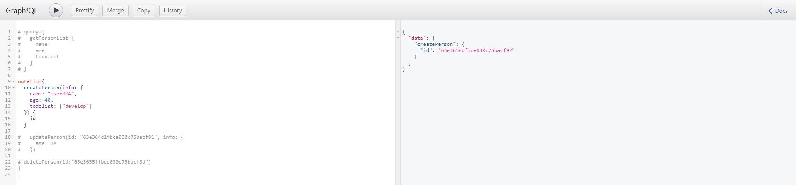

# GraphQL CRUD 練習

- 安裝 express, express-grapgql, graphql
    > https://graphql.org/graphql-js/running-an-express-graphql-server/
- 資料庫使用 mongodb，透過 mongoose 操作資料
    > https://mongoosejs.com/docs/index.html

### GraphQL
透過`buildSchema`定義資料類型與方法，`root`實作方法。

> 查詢query，修改資料mutation

### DB
`new mongoose.Schema`定義資料庫存取類型，`mongoose.model`連結資料表

